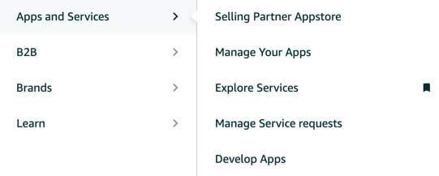
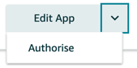

+++
title = "How to run sale promotions on Amazon using Python"
date = "2024-04-11"
+++

This is a no bullshit, to the point guide on how to run sale promotions on Amazon through the [Selling Partner API (SP API)](https://developer-docs.amazon.com/sp-api/) in Python.

## Step 1 » Get the necessary credentials
To communicate with the SP API, you need a `client_id`, a `client_secret`, a `refresh_token` and the `seller_id`.

1. Login to sellercentral, open the menu using the three lines in the top left, locate the option _Apps and Services_, then select _Develop Apps_ in the submenu.

2. If not done already, set up a developer profile in this page. If not requesting restricted roles, which is not necessary for our purposes, you can enter _"internal tests"_ in all free text fields in the _Use Cases_ and _Security Controls_ sections. Your registration should be approved within a few minutes.
3. Going back to the page opened in step 1, click _+ Add new app client_, enter an appropriate name and select `SP API` as the API type. I have selected the _Pricing_, _Inventory and Order Tracking_ and _Product Listing_ roles, but probably not all of them are required. I selected _No_ to the question regarding the delegation of access to PII, but you might want to select _Yes_, depending on your circumstances.
4. You can now click _View_ in the _LWA credentials_ column to display the `client_id` and `client_secret`.
5. Next, click the down arrow next to _Edit App_ and select _Authorise_. You'll see your `refresh_token`.

6. Your `seller_id` can be found on [this page](https://developer.amazon.com/settings/console/mycid). Here, it is referenced as _Your customer ID_.

## Step 2 » Discount your products
I will give you the bare bones, minimum working example to discount a single product. I trust you can update the script to fit your needs. The example is for Amazon Germany 🇩🇪, but you can easily adjust the marketplace. I'm using [`python-amazon-sp-api` package](https://github.com/saleweaver/python-amazon-sp-api), which is a wrapper for the previously mentioned [Selling Partner API (SP API)](https://developer-docs.amazon.com/sp-api/).
```python
from sp_api.api.listings_items.listings_items import ListingsItems
from sp_api.base.marketplaces import Marketplaces

# don't hard code confidential data
refresh_token = "<refresh_token>"
client_id = "<client_id>"
client_secret = "<client_secret>"
seller_id = "<seller_id>"

amazon_sku = "<amazon_sku>"
sale_price = 14.99
currency = "EUR"
sale_start = "2024-04-11T13:52:00Z"
sale_end = "2024-04-25T23:00:00Z"

client = ListingsItems(
    marketplace=Marketplaces.DE,
    credentials={
        "refresh_token": refresh_token,
        "lwa_app_id": client_id,
        "lwa_client_secret": client_secret
    }
)

response = client.patch_listings_item(
    sellerId=seller_id,
    sku=amazon_sku,
    marketplaceIds=f"{Marketplaces.DE.marketplace_id}",
    body={
        "productType": "PRODUCT",
        "patches": [
            {
                "op": "replace",
                "path": "/attributes/purchasable_offer",
                "value": [
                    {
                        "marketplace_id": Marketplaces.DE.marketplace_id,
                        "currency": currency,
                        "discounted_price": [
                            {
                                "schedule": [
                                    {
                                        "start_at": sale_start,
                                        "end_at": sale_end,
                                        "value_with_tax": sale_price
                                    }
                                ]
                            }
                        ]
                    }
                ]
            }
        ]
    }
)

assert response.payload["status"] == "ACCEPTED"
```

Hopefully this helps someone!

Chris