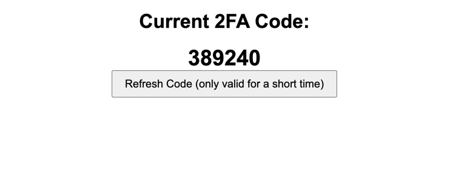

+++
title = "Facebook App Review without Test Accounts"
date = "2024-04-17"
+++

In this post I'll give you a no-bullshit guide to getting your facebook app reviewed without access to test accounts.

I recently started working on a Facebook Messenger chatbot. In order for other people to be able to use it, the app needs to be reviewed. During the review, a facebook "employee" will try to use your app. Maybe you can already see the problem: The app cannot be used by other people until it is reviewed, but other people need to use it in order for it to be reviewed.

Usually, you'd have to create a test user for this purpose, but that functionality is currently broken, and seems to have been for quite a while.

It is possible to circumvent this problem by either creating another facebook account and giving it the tester role in your app, then letting the Facebook review staff know the login data for this account. Alternatively, you could give them access to your own account.

No matter what you choose, there's one major problem: Facebook will probably block the login attempt due to _unsual activity_.

I have solved this problem by activating 2FA for the test user account and making the generated TOTP codes available to the review staff.

For this, I first extracted the token the TOTP codes are based on from Authy using [this guide](https://gist.github.com/gboudreau/94bb0c11a6209c82418d01a59d958c93). You'll have to find out how to do that for your TOTP app of choice.

Next, I've adapted [this guide](https://www.reddit.com/r/facebook/comments/16onkyz/how_to_get_your_meta_app_reviewed_without_test/) to a simple Flask server to run on my Hetzner VPS. 

I've created a file called `fb_t` containing the TOTP token. And here's the flask server:

```python
from flask import Flask
import pyotp

app = Flask(__name__)

@app.route('/')
def hello_world():
    with open("fb_t", "r") as handle:
        s = handle.read().strip()

    totp = pyotp.TOTP(s)
    code = totp.now()
    return """
<!DOCTYPE html>
<html>
<head>
    <title>2FA Code Retriever</title>
    <style>
        body {
            font-family: Arial, sans-serif;
            text-align: center;
        }
        #code {
            font-size: 36px;
            font-weight: bold;
            margin-top: 20px;
        }
        button {
            padding: 10px 20px;
            font-size: 18px;
        }
    </style>
</head>"""+f"""
<body>
    <h1>Current 2FA Code:</h1>
    <div id="code">{code}</div>
    <button onClick="window.location.reload();">Refresh Code (only valid for a short time)</button>
</body>
</html>
    """

if __name__ == '__main__':
    app.run(host='0.0.0.0', port=5005)
```

It's dirty, but that's the whole point. It's a one time good-enough-is-good-enough kind of solution.

Here's what the TOTP page looks like:


As a last step, I've submitted the app for review, mentioning the email and password for the facebook account as well as how to generate the TOTP codes and where to enter them. I've also recorded a screencast showing all the steps from opening a browser in incognito mode to successfully interacting with the chatbot. My app was reviewed and verified within 24 hours.

I hope this helps someone.

Chris
